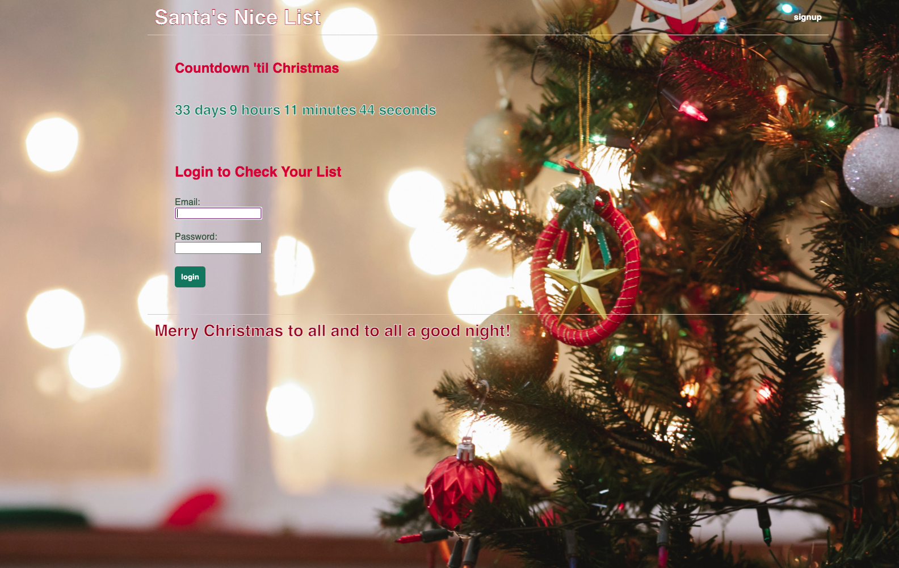
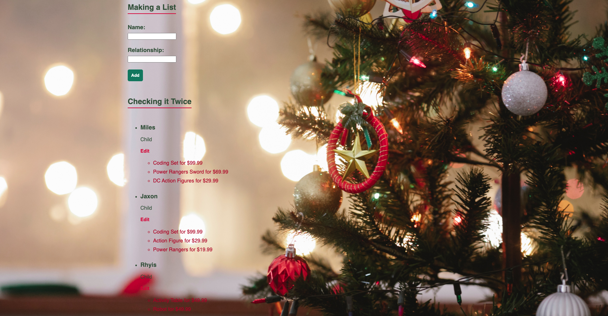

  # Santa's Nice List
  

  ## Description
  Santa's Nice List is the perfect app for users who are writing their Christmas lists on paper. Create a password-protected log-in to keep your list and their gifts away from prying eyes and organized.

  ## Table of Contents
  * [Installation](#installation-instructions)
  * [Usage](#usage)
  * [Examples](#examples)
  * [Questions](#questions)
  
  
  

  ## Installation Instructions
  Navigate to [Santa's Nice List](https://santasnicelist.herokuapp.com/)

  ## Usage
  Navigate to the signup link in the upper-right corner and enter a username, valid email, and password. Once you've signed-in or logged on the site will direct you to your dashboard where you can start your own list.

  
  ## Contributing
  I appreciate your interest in improving this project, however I am not accepting contributions at this time.
  
  
  ## Examples
  Pictures of Website
  
  

  ## Questions
  If you have any questions or need to report bugs please reach out to Lori Timmons at [LoriTimmons](https://www.github.com/LoriTimmons) or Bre Harvey at [HarvBCoding](https://www.github.com/HarvBCoding).
  
  

